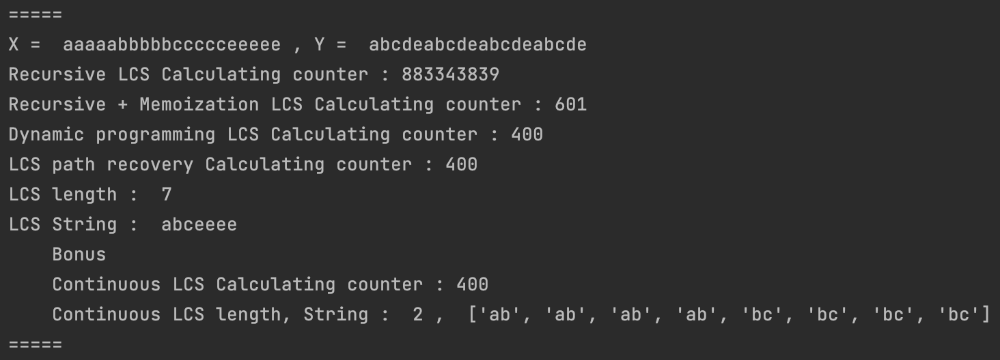
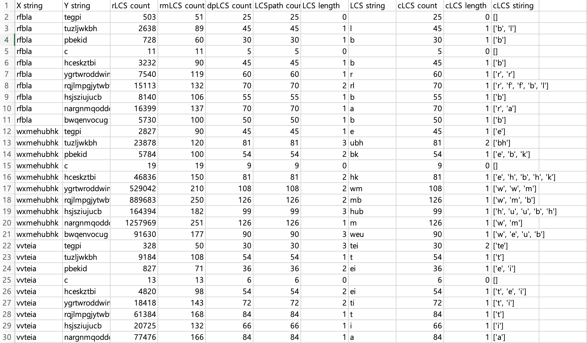
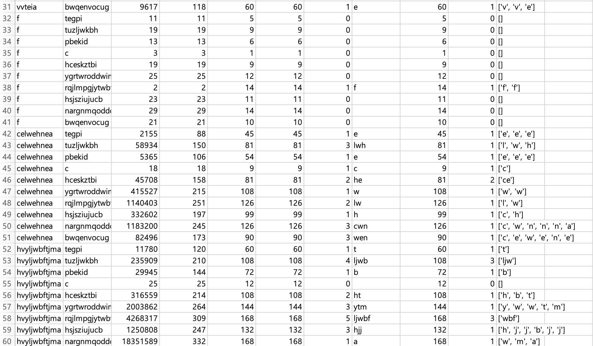
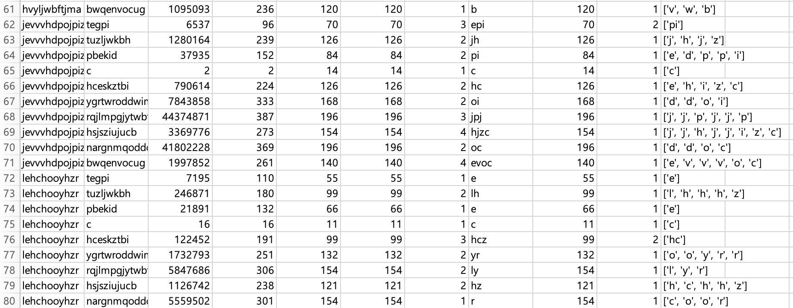
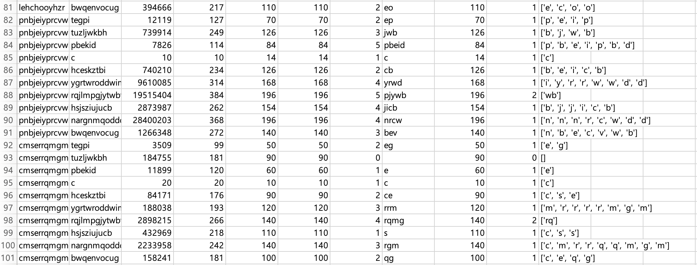
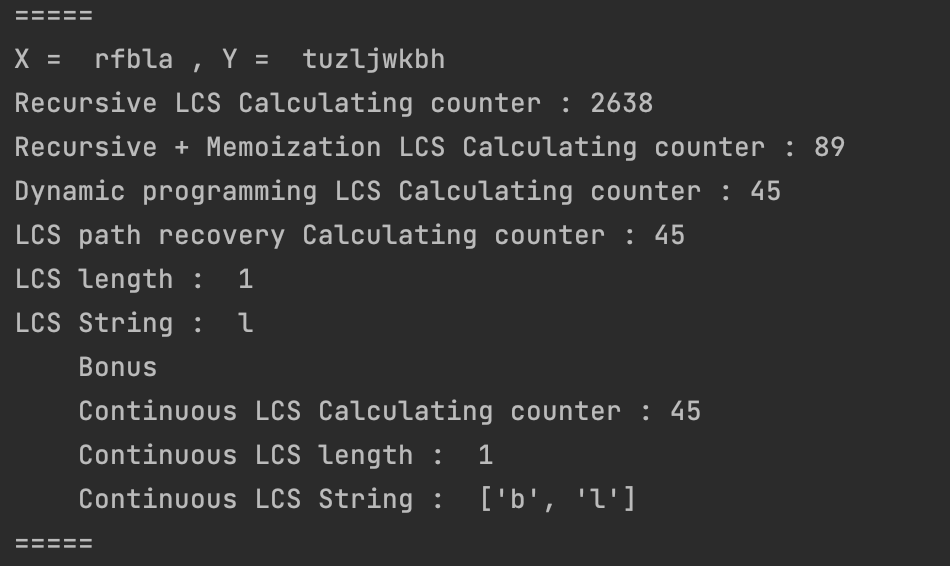

# 알고리즘 과제

퀵정렬을 파이썬에서 구현해 보았다.

### 반복문으로 퀵정렬

```python
import numpy as np
import random
import sys

sys.setrecursionlimit(10 ** 6)
cnt = 0
i_cnt = 0

def ite_quick_sort(A, p, r):  # 배열과 시작과 끝의 인덱스 번호를 받아온다
    if p >= r:  # 원소의 갯수가 1개 이하면 종료
        return
    stack = [0] * (r - p + 1)  # 배열의 크기만큼 스택 정의
    top = -1  # 스택 천장을 의미
    top += 1
    stack[top] = p  # 스택에다가 시작과 끝 인덱스 번호를 저장
    top += 1
    stack[top] = r
    while top >= 0:  # 스택이 빌 때까지 반복
        r = stack[top]
        top -= 1
        p = stack[top]
        top -= 1  # 시작과 끝 인덱스 번호를 스택에서 받아옴

        q = partition(A, p, r)  # 피벗 원소를 기준 으로 분할
        if q - 1 > p:  # 피벗 원소 왼쪽 구역이 존재할 시
            top += 1
            stack[top] = p
            top += 1
            stack[top] = q - 1  # 왼쪽 구역의 시작과 끝 인덱스 번호를 저장

        if q + 1 < r:  # 피벗 원소 오른쪽 구역이 존재할 시
            top += 1
            stack[top] = q + 1
            top += 1
            stack[top] = r  # 오른쪽 구역의 시작과 끝 인덱스 번호를 저장

    # 스택에 홀수번째하고 짝수번째에 각각 구역이 나올 것이고 그 구역 내의 정리가 되면 저장하는 스택이 없어지니 결국 다 빼면서 마무리

def partition(A, p, r):
    piv = r  # 마지막 원소를 피벗 으로
    s = p - 1  # 피벗 보다 작은 원소를 보관할 구역의 마지막 인덱스 번호
    global cnt
    for i in range(r - p):  # 받은 배열의 모든 원소 확인
        cnt += 1
        if A[p + i] <= A[piv]:  # 피벗 보다 작은 원소면
            s += 1
            A[p + i], A[s] = A[s], A[p + i]
    s += 1
    A[r], A[s] = A[s], A[r]  # 피벗 원소를 자신 보다 작은 원소가 있는 구역 오른쪽에 두기
    return s  # 피벗 원소 인덱스 번호를 반환

    # 피벗 원소를 제 자리에 두고 비교연산을 몇번 수행하는지 센다

N = [10 ** 2, 10 ** 4, 10 ** 6]

for i in N:
    for j in range(30):
        A = np.random.rand(i)
        ite_quick_sort(A, 0, len(A) - 1)
        i_cnt += cnt
        cnt = 0
    print(i, "에서의 반복적 퀵정렬 평균 연산 횟수는", i_cnt / 30, "번")
print("프로그램에서의 전체 연산 횟수는", i_cnt , "번")
```

### 재귀적 퀵정렬

```python
import numpy as np
import random
import sys

sys.setrecursionlimit(10 ** 6)
cnt = 0
r_cnt = 0

def rec_quick_sort(A, p, r):  # 배열과 시작과 끝의 인덱스 번호를 받아온다
    if p >= r:  # 원소의 갯수가 1개 이하면 종료
        return
    q = partition(A, p, r)  # 피벗 원소를 기준 으로 분할
    rec_quick_sort(A, p, q - 1)  # 왼쪽 정렬
    rec_quick_sort(A, q + 1, r)  # 오른쪽 정렬

    # 재귀적으로 왼쪽 구역과 오른쪽 구역으로 나눠서 처리한다

def partition(A, p, r):
    piv = r  # 마지막 원소를 피벗 으로
    s = p - 1  # 피벗 보다 작은 원소를 보관할 구역의 마지막 인덱스 번호
    global cnt
    for i in range(r - p):  # 받은 배열의 모든 원소 확인
        cnt += 1
        if A[p + i] <= A[piv]:  # 피벗 보다 작은 원소면
            s += 1
            A[p + i], A[s] = A[s], A[p + i]
    s += 1
    A[r], A[s] = A[s], A[r]  # 피벗 원소를 자신 보다 작은 원소가 있는 구역 오른쪽에 두기
    return s  # 피벗 원소 인덱스 번호를 반환

    # 피벗 원소를 제 자리에 두고 비교연산을 몇번 수행하는지 센다

N = [10 ** 2, 10 ** 4, 10 ** 6]

for i in N:
    for j in range(30):
        A = np.random.rand(i)
        rec_quick_sort(A, 0, len(A) - 1)
        r_cnt += cnt
        cnt = 0
    print(i, "에서의 재귀적 퀵정렬 평균 연산 횟수는", r_cnt / 30, "번")
print("프로그램에서의 전체 연산 횟수는", r_cnt, "번")
```

### 랜덤 피벗 퀵정렬

```python
import numpy as np
import random
import sys

sys.setrecursionlimit(10 ** 6)
cnt = 0
rr_cnt = 0

def partition(A, p, r):
    piv = r  # 마지막 원소를 피벗 으로
    s = p - 1  # 피벗 보다 작은 원소를 보관할 구역의 마지막 인덱스 번호
    global cnt
    for i in range(r - p):  # 받은 배열의 모든 원소 확인
        cnt += 1
        if A[p + i] <= A[piv]:  # 피벗 보다 작은 원소면
            s += 1
            A[p + i], A[s] = A[s], A[p + i]
    s += 1
    A[r], A[s] = A[s], A[r]  # 피벗 원소를 자신 보다 작은 원소가 있는 구역 오른쪽에 두기
    return s  # 피벗 원소 인덱스 번호를 반환

    # 피벗 원소를 제 자리에 두고 비교연산을 몇번 수행하는지 센다

def rr_quick_sort(A, p, r):  # 배열과 시작과 끝의 인덱스 번호를 받아온다
    if p >= r:  # 원소의 갯수가 1개 이하면 종료
        return
    q = r_partition(A, p, r)  # 피벗 원소를 기준 으로 분할
    rr_quick_sort(A, p, q - 1)  # 왼쪽 정렬
    rr_quick_sort(A, q + 1, r)  # 오른쪽 정렬

    # 재귀적으로 왼쪽 구역과 오른쪽 구역으로 나눠서 처리한다

def r_partition(A, p, r):
    pivot = random.randint(p, r)  # 불러온 구역의 인덱스 번호 중에서 골라 피벗 원소의 인덱스 번호로 사용한다.
    A[pivot], A[r] = A[r], A[pivot]  # 랜덤 피벗 원소를 마지막 원소 위치로 옮긴다
    return partition(A, p, r)  # 만들어진 배열로 분할 한다.

N = [10 ** 2, 10 ** 4, 10 ** 6]

for i in N:
    for j in range(30):
        A = np.random.rand(i)
        rr_quick_sort(A, 0, len(A) - 1)
        rr_cnt += cnt
        cnt = 0
    print(i, "에서의 재귀적 랜덤 피벗 퀵정렬 평균 연산 횟수는", rr_cnt / 30, "번")
print("전체 연산 횟수는", rr_cnt, "번")
```

## 결과

각 정렬당 실제 데이터

| ite10^2 | rec10^2 | rr10^2 |  | ite10^4 | rec10^4 | rr10^4 |
| --- | --- | --- | --- | --- | --- | --- |
| 612 | 634.2 | 661.1 |  | 156814.5 | 158763.5 | 156796.7 |
| 649.7 | 607.6 | 684.2 |  | 155964.2 | 157224.9 | 157228.3 |
| 645.1 | 615.6 | 637.9 |  | 154829.6 | 155139.9 | 157090.1 |
| 656.9 | 641.7 | 634.8 |  | 154388.3 | 155418.3 | 158140 |
| 670.4 | 673.8 | 626.9 |  | 156044.2 | 155155 | 157894.7 |
| 637.8 | 644 | 611.7 |  | 154810.5 | 154816.7 | 154869.8 |
| 653.4 | 661.1 | 679.6 |  | 152752 | 151541.5 | 155913.2 |
| 670.4 | 646 | 678.1 |  | 154317.4 | 157710.4 | 157684.2 |
| 632.2 | 626.6 | 640.9 |  | 157424.9 | 160417.9 | 156512.8 |
| 616.6 | 643.5 | 652.4 |  | 154624.7 | 152263.3 | 156924.1 |

| ite10^6 | rec10^6 | rr10^6 |  | ite | rec | rr |
| --- | --- | --- | --- | --- | --- | --- |
| 24668279.5 | 24756626.9 | 24845463.9 |  | 246682795 | 247566269, | 248454639 |
| 24833954.3 | 24820813.8 | 24986810.1 |  | 248339543 | 248208138 | 249868101 |
| 25267243.7 | 24860456.7 | 25062822.6 |  | 252672437 | 248604567 | 250628226 |
| 24984448.1 | 24822575.4 | 25021892.9 |  | 249844481 | 248225754 | 250218929 |
| 25082926.3 | 24644670.9 | 24882422.8 |  | 250829263 | 246446709 | 248824228 |
| 25067892.1 | 24874004 | 25063528.1 |  | 250678921 | 248740040 | 250635281 |
| 25186908.4 | 24961933 | 24957468.9 |  | 251869084 | 249619330 | 249574689 |
| 24953885.8 | 24979921.3 | 24825369.3 |  | 249538858 | 249799213 | 248253693 |
| 24756064.3 | 24987098.9 | 24985138.4 |  | 247560643 | 249870989 | 249851384 |
| 24922159.9 | 25278697.8 | 24991848.7 |  | 249221599 | 252786978 | 249918487 |

### 그래프

10^2 사이즈의 배열의 경우 연산 횟수 그래프


10^4 사이즈의 배열의 경우 연산 횟수 그래프


10^6 사이즈의 배열의 경우 연산 횟수 그래프


전체 연산 횟수 그래프


### 시간복잡도

랜덤피벗을 기준으로 보자면 매번 파티션을 나눌때 랜덤한 피벗을 잡아서 재귀한다는 의미는 우리가 파티션을 나눌때 최악의 경우의 수인 최대값이랑 최소값을 피벗으로 잡는 경우가 0에 수렴하게 된다는 의미이다.

그렇기에 퀵정렬의 이상적인 시간복잡도인 O(nlogn)이 나와야 한다.

n이 10^2일때 200, 10^4일때 40000 10^6일때 6000000정도이고

위에 나온 실측 데이터들을 보자면 10^2일때 700정도, 10^4일때 160000 정도, 10^6일때 25000000정도 나오므로 대충 4nlogn 정도가 나오게 된다.

n^2보다 작으므로 O(nlogn)임을 증명했다.

### 결론

반복문으로 만든 퀵정렬이 재귀적으로 실행된 퀵정렬이랑 실행횟수가 비슷한게 신기하였지만 구현이 어려울뿐 결국 실행 방식은 같기 때문에 비슷한 횟수로 나온다고 생각된다. 

그리고 랜덤피벗으로 하였을시 처음에 정말 랜덤한 피벗만 정하고 그 피벗을 마지막 원소로 옮겨서 나머지 연산을 똑같이 하니 시행횟수가 거의 비슷했다. 분명 랜덤 한 원소를 피벗으로 잡고 돌렸는데 이렇게 결과가 나오니 당황했다.

하지만 생각해보면 결국엔 랜덤해서 얻는 값을 피벗으로 잡는다고 하더라도 결국엔 랜덤한 값이랑 랜덤한 값이랑 바꾸고 같은 방식으로 재귀하므로 같은 값이 나오는게 맞다.

그렇기에 생각하건데 랜덤한 피벗값을 잡는것은 실제 데이터가 어떤것이 들어올지 모르므로 시작값을 피벗을 잡을시 대부분의 데이터가 앞에 최소값이 많이 분포한 데이터라든지 끝값을 피벗으로 잡을시 대부분의 데이터가 뒤에 최대값이 많이 분포한 데이터같은 경우보다 효율이 좋다는 것을 알게 되었다.


# 알고리즘 LCS

두개의 주어진 스트링의 LCS (Longest Common Substring)를 구하는 알고리즘을 파이썬으로 구현해보았다.

## 코드

```python
import random
import string
import csv
import sys

sys.setrecursionlimit(10 ** 8)
cal_count = 0

def rLCS(X, Y, m, n):
    global cal_count
    cal_count += 1
    if m == 0 or n == 0: return 0
    if X[m - 1] == Y[n - 1]:  # 인덱스 번호로 계산하기 위해서 -1
        return rLCS(X, Y, m - 1, n - 1) + 1
    else:
        return max(rLCS(X, Y, m - 1, n), rLCS(X, Y, m, n - 1))

LCS_T = [[None for col in range(21)] for row in range(21)]

def rmLCS(X, Y, m, n):
    global LCS_T, cal_count
    cal_count += 1
    if m == 0 or n == 0:
        LCS_T[m][n] = 0
        return LCS_T[m][n]
    if LCS_T[m][n] is None:
        if X[m - 1] == Y[n - 1]:
            LCS_T[m][n] = rmLCS(X, Y, m - 1, n - 1) + 1
        else:
            LCS_T[m][n] = max(rmLCS(X, Y, m - 1, n), rmLCS(X, Y, m, n - 1))
    return LCS_T[m][n]

def dpLCS(X, Y):
    global cal_count
    LCS_Table = [[0 for col in range(len(Y) + 1)] for row in range(len(X) + 1)]
    for i in range(len(X)):
        for j in range(len(Y)):
            cal_count += 1
            if X[i] == Y[j]:
                LCS_Table[i + 1][j + 1] = LCS_Table[i][j] + 1
            else:
                LCS_Table[i + 1][j + 1] = max(LCS_Table[i][j + 1], LCS_Table[i + 1][j])
    return LCS_Table[len(X)][len(Y)]

LCS_string = [['' for col in range(21)] for row in range(21)]

def LCSpath(X, Y):
    global cal_count
    global LCS_string
    LCS_Table = [[0 for col in range(len(Y) + 1)] for row in range(len(X) + 1)]
    LCS_path = [['0' for col in range(len(Y) + 1)] for row in range(len(X) + 1)]
    for i in range(len(X)):
        for j in range(len(Y)):
            cal_count += 1
            if X[i] == Y[j]:
                LCS_Table[i + 1][j + 1] = LCS_Table[i][j] + 1
                LCS_path[i + 1][j + 1] = 'cross'
                LCS_string[i + 1][j + 1] = ''.join([LCS_string[i][j], X[i]])
            else:
                if LCS_Table[i][j + 1] > LCS_Table[i + 1][j]:
                    LCS_Table[i + 1][j + 1] = LCS_Table[i][j + 1]
                    LCS_path[i + 1][j + 1] = 'up'
                    LCS_string[i + 1][j + 1] = LCS_string[i][j + 1]
                else:
                    LCS_Table[i + 1][j + 1] = LCS_Table[i + 1][j]
                    LCS_path[i + 1][j + 1] = 'left'
                    LCS_string[i + 1][j + 1] = LCS_string[i + 1][j]
    return LCS_Table[len(X)][len(Y)]

LCS_l = []

def cLCS(X, Y):
    global cal_count
    global LCS_l
    LCS_Table = [['' for col in range(len(Y) + 1)] for row in range(len(X) + 1)]
    LCS_len = 0
    LCS_str = []
    for i in range(len(X)):
        for j in range(len(Y)):
            cal_count += 1
            if X[i] == Y[j]:
                LCS_Table[i + 1][j + 1] = ''.join([LCS_Table[i][j], X[i]])
    for i in LCS_Table:
        for j in i:
            if len(j) >= LCS_len:
                LCS_len = len(j)
                LCS_str.append(j)
    if LCS_len > 0:
        for i in LCS_str:
            if len(i) == LCS_len:
                LCS_l.append(i)
    return LCS_len

result = []
result.append(['X string','Y string','rLCS count','rmLCS count','dpLCS count','LCSpath count','LCS length','LCS string','cLCS count','cLCS length','cLCS stiring'])

def LCS_test(X, Y):
    global cal_count, result
    global LCS_string, LCS_T, LCS_l
    data = []
    data.append(X)
    data.append(Y)
    print("=====")
    print("X = ", X, ", Y = ", Y)
    rlcs = rLCS(X, Y, len(X), len(Y))
    print("Recursive LCS Calculating counter :", cal_count)
    data.append(cal_count)
    cal_count = 0
    rmlcs = rmLCS(X, Y, len(X), len(Y))
    LCS_T = [[None for col in range(21)] for row in range(21)]
    print("Recursive + Memoization LCS Calculating counter :", cal_count)
    data.append(cal_count)
    cal_count = 0
    dplcs = dpLCS(X, Y)
    print("Dynamic programming LCS Calculating counter :", cal_count)
    data.append(cal_count)
    cal_count = 0
    lcspath = LCSpath(X, Y)
    print("LCS path recovery Calculating counter :", cal_count)
    data.append(cal_count)
    cal_count = 0
    if rlcs == rmlcs == dplcs == lcspath:
        print("LCS length : ", rlcs)
    data.append(rlcs)
    print("LCS String : ", LCS_string[len(X)][len(Y)])
    data.append(LCS_string[len(X)][len(Y)])
    LCS_string = [['' for col in range(21)] for row in range(21)]
    print("\tBonus")
    clcs = cLCS(X, Y)
    print("\tContinuous LCS Calculating counter :", cal_count)
    data.append(cal_count)
    cal_count = 0
    print("\tContinuous LCS length : ", clcs)
    data.append(clcs)
    print("\tContinuous LCS String : ", LCS_l)
    data.append(LCS_l)
    LCS_string = [['' for col in range(21)] for row in range(21)]
    LCS_l = []
    result.append(data)
    print("=====")

X = []
Y = []
string_length = [1, 10, 15]
letters = string.ascii_lowercase
for i in range(2):
    for j in range(5):
        str_len = random.randint(string_length[i], string_length[i + 1])
        X.append(''.join(random.choice(letters) for k in range(str_len)))
        Y.append(''.join(random.choice(letters) for k in range(str_len)))
print(X, Y)
for i in X:
    for j in Y:
        LCS_test(i, j)
with open('result.csv','w') as file :
    write = csv.writer(file)
    write.writerows(result)
'''
X = 'aaaaabbbbbccccceeeee'
Y = 'abcdeabcdeabcdeabcde'
LCS_test(X,Y)
'''
```

## 입력 데이터

입력 데이터로 나온 랜덤 X,Y의 값

```python
X = ['rfbla', 'wxmehubhk', 'vvteia', 'f', 'celwehnea', 'hvyljwbftjma', 'jevvvhdpojpizc', 'lehchooyhzr', 'pnbjeiyprcvwbd', 'cmserrqmgm']
Y = ['tegpi', 'tuzljwkbh', 'pbekid', 'c', 'hceskztbi', 'ygrtwroddwim', 'rqjlmpgjytwbff', 'hsjsziujucb', 'nargnmqoddcwnq', 'bwqenvocug']
```

### 입력데이터 길이 한계



입력데이터의 길이가 20개, 20개일 경우 10억번 정도의 재귀를 하면서 오버플로우를 일으키는 경우가 있어서 최대 랜덤 입력데이터 길이를 15로 제한하였다.

만약에 최대 랜덤 입력데이터 길이를 20개로 하고 싶다면 string_length의 변수중 15를 20으로 변경하면 자동으로 만들어 질 것이다.

## 출력 결과

결과가 너무 많은 관계로 첫 번째, 두 번째, 마지막 결과의 캡쳐본하고 결과를 엑셀로 정리한 엑셀파일 캡쳐본으로













## 구글 Bard를 이용한 코딩

질문한 프롬프트

```python
Do you know what LCS algorithm is?
-----
please write 5 version of LCS python code that counts
1.Recursive version
2.Recursive version + Memoization Technique
3.Dynamic Programming
4.LCS path recovery
-----
write python code that finding the longest consecutive substrings by modifying the LCS problem
```

결과로 나온 코드를 합친 코드

```python
def rlcs(x, y):
    if len(x) == 0 or len(y) == 0:
        return 0
    elif x[-1] == y[-1]:
        return 1 + rlcs(x[:-1], y[:-1])
    else:
        return max(rlcs(x, y[:-1]), rlcs(x[:-1], y))

def rmlcs(x, y, memo):
    if (x, y) in memo:
        return memo[(x, y)]
    elif len(x) == 0 or len(y) == 0:
        return 0
    elif x[-1] == y[-1]:
        return 1 + rmlcs(x[:-1], y[:-1], memo)
    else:
        v1 = rmlcs(x, y[:-1], memo)
        v2 = rmlcs(x[:-1], y, memo)
        memo[(x, y)] = max(v1, v2)
        return memo[(x, y)]

def dplcs(x, y):
    dp = [[0 for _ in range(len(y) + 1)] for _ in range(len(x) + 1)]
    for i in range(len(x) + 1):
        for j in range(len(y) + 1):
            if i == 0 or j == 0:
                dp[i][j] = 0
            elif x[i - 1] == y[j - 1]:
                dp[i][j] = 1 + dp[i - 1][j - 1]
            else:
                dp[i][j] = max(dp[i - 1][j], dp[i][j - 1])
    return dp[len(x)][len(y)]

def lcspath(x, y):
    dp = [[0 for _ in range(len(y) + 1)] for _ in range(len(x) + 1)]
    for i in range(len(x) + 1):
        for j in range(len(y) + 1):
            if i == 0 or j == 0:
                dp[i][j] = 0
            elif x[i - 1] == y[j - 1]:
                dp[i][j] = 1 + dp[i - 1][j - 1]
            else:
                dp[i][j] = max(dp[i - 1][j], dp[i][j - 1])

    i = len(x)
    j = len(y)
    lcs = []
    while i > 0 and j > 0:
        if x[i - 1] == y[j - 1]:
            lcs.append(x[i - 1])
            i -= 1
            j -= 1
        elif dp[i - 1][j] > dp[i][j - 1]:
            i -= 1
        else:
            j -= 1
    lcs.reverse()
    return lcs

x = "ABCD"
y = "AEBCD"
print(rlcs(x, y))
memo = {}
print(rmlcs(x, y, memo))
print(dplcs(x, y))
print(lcspath(x, y))
```

### 작성한 코드랑 비교해보았을때 느낀점

대부분의 코드 느낌은 직접 작성한 코드랑 비슷하지만 Bard에서 만들어준 코드 중 LCS 경로복구 코드에서 흥미로운 방식으로 경로 복구를 해가는것을 보았다.

내가 작성한 코드는 이차원 배열에 LCS 표를 짜는것과 같은 방식으로 구해가면서 LCS문자열을 보관해두는데 Bard에서 작성한 코드는 이미 만들어진 LCS표에서 정말 경로를 “복구”해가면서 문자열을 만들었다.

새로운 이차원 배열이 필요 없으면서 진짜 경로를 복구해가는 과정이 있는 Bard의 코드가 경로복구라는 개념에 더 적합해보이긴 하지만 내가 작성한 코드는 LCS표를 만들어갈때 표에 넣고 Bard의 코드는 만들어진 표를 다시 한번 보면서 만들어가기때문에 계산 횟수면에서는 내가 작성한 코드가 더 좋다고 생각된다.

## 결론

재귀로 하는 경우 67번째 결과처럼 4천만 이상의 횟수로 재귀하기도 한다. 하지만 DP방식으로 계산되는 알고리즘은 mn번의 계산만 하게된다.

재귀는 같은 연산도 계속 반복하게 하다보니 입력데이터의 길이가 길수록 기하급수적으로 계산 결과가 증가하고 DP방식으로 계산하게 되면 표를 기반으로 채워나가는 방식으로 계산하므로 mn크기의 표만큼의 계산만 하면 된다.

재귀만으로 풀게되는 방식은 엄청난 중복호출때문에 프로그램에 지장을 준다는것을 실제로 확인해보았다. 

프로그램이 어떻게 돌아갈지 생각하면서 코드를 짜야한다는것이 굉장히 중요하단것을 직접 경험하게 되고 이런식으로 재귀하면서 중복호출이 심한 프로그램을 동적프로그래밍 방법으로 짜보니 흥미로웠다

그리고 추가적으로 Bard를 이용해서 LCS코드를 만들어보았는데 굉장히 정석적인 코딩 방식을 보여준다고 생각하고 꽤나 시간을 들여서 만든 코드를 금방 완성해내는것을 보고 많이 놀라웠다. 생각보다 꽤나 정확하고 효율적인 코드를 만들어냈다고 생각하고 다음에는 비교용으로 만드는 것보다 Bard를 이용해 코드의 틀을 만들어보고 거기에 추가를 하거나 고치는 방식으로 만들었다면 효율적으로 빠르게 만들었을수 있다고 생각되었다.