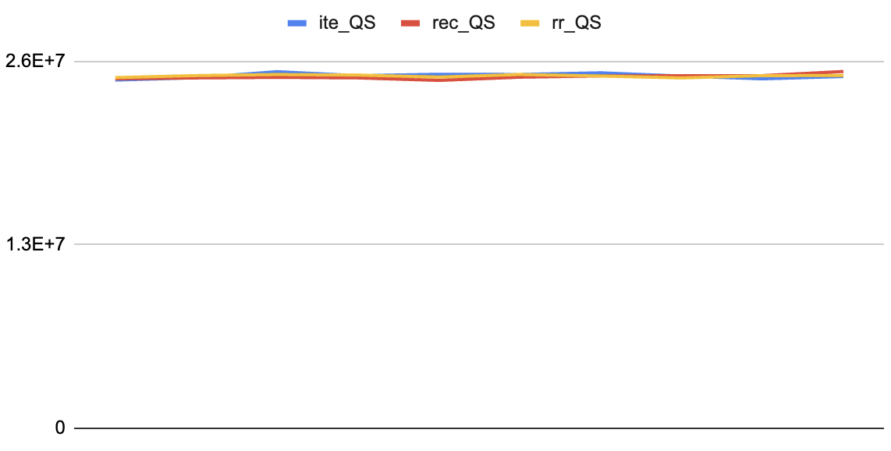

# QuickSort

I implemented Quick Sort in Python using iteration and recursion. Also Random Pivot Quick Sort. I then compared the number of executions for each approach.

- [Result](#Result)
- [Conclusion](#Conclusion)

## Result

### raw data

| ite10^2 | rec10^2 | rr10^2 |     | ite10^4  | rec10^4  | rr10^4   |
| ------- | ------- | ------ | --- | -------- | -------- | -------- |
| 612     | 634.2   | 661.1  |     | 156814.5 | 158763.5 | 156796.7 |
| 649.7   | 607.6   | 684.2  |     | 155964.2 | 157224.9 | 157228.3 |
| 645.1   | 615.6   | 637.9  |     | 154829.6 | 155139.9 | 157090.1 |
| 656.9   | 641.7   | 634.8  |     | 154388.3 | 155418.3 | 158140   |
| 670.4   | 673.8   | 626.9  |     | 156044.2 | 155155   | 157894.7 |
| 637.8   | 644     | 611.7  |     | 154810.5 | 154816.7 | 154869.8 |
| 653.4   | 661.1   | 679.6  |     | 152752   | 151541.5 | 155913.2 |
| 670.4   | 646     | 678.1  |     | 154317.4 | 157710.4 | 157684.2 |
| 632.2   | 626.6   | 640.9  |     | 157424.9 | 160417.9 | 156512.8 |
| 616.6   | 643.5   | 652.4  |     | 154624.7 | 152263.3 | 156924.1 |

| ite10^6    | rec10^6    | rr10^6     |     | ite       | rec        | rr        |
| ---------- | ---------- | ---------- | --- | --------- | ---------- | --------- |
| 24668279.5 | 24756626.9 | 24845463.9 |     | 246682795 | 247566269, | 248454639 |
| 24833954.3 | 24820813.8 | 24986810.1 |     | 248339543 | 248208138  | 249868101 |
| 25267243.7 | 24860456.7 | 25062822.6 |     | 252672437 | 248604567  | 250628226 |
| 24984448.1 | 24822575.4 | 25021892.9 |     | 249844481 | 248225754  | 250218929 |
| 25082926.3 | 24644670.9 | 24882422.8 |     | 250829263 | 246446709  | 248824228 |
| 25067892.1 | 24874004   | 25063528.1 |     | 250678921 | 248740040  | 250635281 |
| 25186908.4 | 24961933   | 24957468.9 |     | 251869084 | 249619330  | 249574689 |
| 24953885.8 | 24979921.3 | 24825369.3 |     | 249538858 | 249799213  | 248253693 |
| 24756064.3 | 24987098.9 | 24985138.4 |     | 247560643 | 249870989  | 249851384 |
| 24922159.9 | 25278697.8 | 24991848.7 |     | 249221599 | 252786978  | 249918487 |

### Graph

- For an array size of 10^2 (100 elements):


- For an array size of 10^4 (10,000 elements):


- For an array size of 10^6 (1,000,000 elements):



- Overall execution counts comparison:


## Conclusion

### Time Complexity

Focusing on the Random Pivot version, the idea of choosing a random pivot for partitioning means that, in the worst-case scenario, we won’t always select the maximum or minimum element as the pivot. This leads to a situation where the worst-case occurrences are minimized, approaching a scenario where the pivot is “balanced” most of the time.

As a result, Quick Sort’s ideal time complexity of O(n log n) is achieved.

For n = 10^2, the result is approximately 200; for n = 10^4, it’s around 40,000; and for n = 10^6, it’s roughly 6,000,000.

Looking at the raw data, we see results around 700 for n = 10^2, 160,000 for n = 10^4, and 25,000,000 for n = 10^6. This suggests that the time complexity behaves approximately as O(n log n).

This confirms that the algorithm is not O(n^2), which would have been the case in a less optimal scenario, and demonstrates that Quick Sort is indeed O(n log n) under typical conditions.

### Conclusion

When comparing the iterative quicksort and recursive quicksort, the execution counts are similar, as the execution method is essentially the same for both approaches.

For the random pivot quicksort, I tested it with sorted arrays to investigate its performance. When the array is sorted, using a fixed pivot strategy (e.g., the first or last element as the pivot) would cause quicksort to degenerate into O(n²) complexity. However, the random pivot quicksort maintained O(nlogn) complexity, which is one of the key advantages of random pivoting.

Here’s the code I used to test the recursive quicksort with a sorted array and the corresponding results:

rec_QS

```python
N = [10 ** 2, 10 ** 4]#, 10 ** 6]

for i in N:
    for j in range(10):
        A = np.random.rand(i)
        a = sorted(A)              # 정렬을 한다
        rec_quick_sort(a, 0, len(a) - 1)
        r_cnt += cnt
        cnt = 0
    print(i, "에서의 재귀적 퀵정렬 평균 연산 횟수는", r_cnt / 10, "번")
print("프로그램에서의 전체 연산 횟수는", r_cnt, "번")
```

```python
100 에서의 재귀적 퀵정렬 평균 연산 횟수는 4950.0 번
10000 에서의 재귀적 퀵정렬 평균 연산 횟수는 49999950.0 번
```

The results showed a significant increase in operation count compared to the original quicksort performance when the data is sorted. For instance, the number of operations for an array of size 100 (which was originally around 600 operations) jumped to about 4950 operations.

```python
N = [10 ** 2, 10 ** 4]#, 10 ** 6]

for i in N:
    for j in range(10):
        A = np.random.rand(i)
        a = sorted(A)              # 정렬을 한다
        rr_quick_sort(a, 0, len(a) - 1)
        rr_cnt += cnt
        cnt = 0
    print(i, "에서의 재귀적 랜덤 피벗 퀵정렬 평균 연산 횟수는", rr_cnt / 10, "번")
print("전체 연산 횟수는", rr_cnt, "번")
```

```python
100 에서의 재귀적 랜덤 피벗 퀵정렬 평균 연산 횟수는 697.4 번
10000 에서의 재귀적 랜덤 피벗 퀵정렬 평균 연산 횟수는 155407.8 번
```

Here, I observed that the random pivot approach kept the number of operations much lower compared to the recursive quicksort with a fixed pivot. Despite starting with sorted data, the random pivot quicksort was able to handle the input efficiently and maintained an O(nlogn) time complexity.
